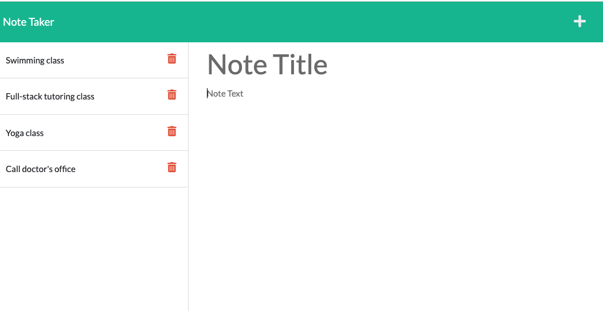

# note-taker
## License

## Table of Contents
  - [Description](#description)
  - [Application Demo](#application-demo)
  - [Installation](#installation)
  - [Usage](#usage)
    - [Code Examples and Screenshots](#code-examples-and-screenshots)
  - [License](#license-1)
  - [Technologies Used](#technologies-used)
  - [Questions](#questions)
## Description
The goal is to build the backend application and connect it with the frontend application to the provided front end code and then deploy the entire application to Heroku.we need to create an application called Note Taker that can be used to retrieve, write, save and delete notes. This application will use an Express.js package. Back end will save and retrieve note data from a JSON file.This application should have both front-end and back-end application.The application should have a db.json file on the back end that will be used to store and retrieve notes using the fs module.HTML routes and API routes needs to be created.`GET /notes` should return the notes.html file.`GET *` should return the index.html file.In API routes,
`GET /api/notes` should read the `db.json` file and return all saved notes as JSON.POST `/api/notes` should receive a new note to save on the request body, add it to the db.json file, and then return the new note to the client .The code for the frontend is already provided.

[Solution URL](https://github.com/ashachakre0906/note-taker)

## User Story
```
AS A small business owner
I WANT to be able to write and save notes
SO THAT I can organize my thoughts and keep track of tasks I need to complete
```
## Acceptance Criteria
```
GIVEN a note-taking application
WHEN I open the Note Taker
THEN I am presented with a landing page with a link to a notes page
WHEN I click on the link to the notes page
THEN I am presented with a page with existing notes listed in the left-hand column, plus empty fields to enter a new note title and the note’s text in the right-hand column
WHEN I enter a new note title and the note’s text
THEN a Save icon appears in the navigation at the top of the page
WHEN I click on the Save icon
THEN the new note I have entered is saved and appears in the left-hand column with the other existing notes
WHEN I click on an existing note in the list in the left-hand column
THEN that note appears in the right-hand column
WHEN I click on the Write icon in the navigation at the top of the page
THEN I am presented with empty fields to enter a new note title and the note’s text in the right-hand column
```
## Application Demo


[Screencastify link](https://drive.google.com/file/d/1Wyv39R48uYPd1VWcdfNde64MVAiZjR-e/view)

***The following image shows the fontend appearance and functionality where user can retrieve, store, add ,save and delete note.***


## Installation
* Install Node in your computer by going to `https://nodejs.org/en/download/`
* Create .gitignore file before installing any npm dependencies and include node_modules/ and .DS_Store/ so that your node_modules directory isn't tracked or uploaded to GitHub.
* Create a new github repository and clone it to your local machine.
* Navigate to the repo which you just created by typing`cd` command  and open it in your code editor by typing command in your terminal `code .`
* Open the terminal in your code editor,initialized the repository with a `package.json` file by running `npm init -y`.
* Install the `Express package`by entering the command `npm i` 
* We also need to install to create random UUID for note taker application.
```
npm install uuid
```
* Run the server by entering the command in your terminal.
```
nodemon server.js
```

### Code Examples and Screenshots
***POST Route for adding new notes***
```
router.post('/notes', (req, res) => {
  console.log(req.body);

  const { title, text } = req.body;

  if (req.body) {
    const newNote = {
      title,
      text,
      id: uuidv4(),
    };
    notes.push(newNote);
    writeToFile("db/db.json", notes);
    res.json(notes);
    console.log(`note added successfully 🚀`);
  } else {
    res.error("Error in adding note");
  }
});
```

## License
This project is license under [MIT](http://www.apache.org/licenses/LICENSE-2.0)

## Technologies Used


## Questions
if you have any questions please reach out to me:<br>
Email Address: chourpagar.asha@gmail.com <br>
Github Repo URL:[GitHub](https://github.com/ashachakre0906)


